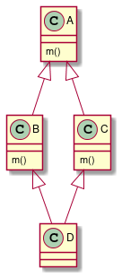
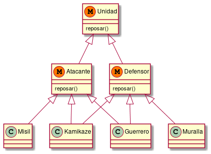

# Mixins y Traits

Los mecanismos de herencia simple no nos alcanzaban para resolver el problema de la clase anterior. Es decir, el hecho de que un guerrero sea tanto un Atacante como un Defensor.


## Origen

Los Mixins aparecen como una idea original Gilad Bracha, con el objetivo de mejorar cómo se modela con herencia simple y los problemas que trae la herencia múltiple.

Los traits, de Stéphane Ducasse, toma la idea de los Mixins y propone una idea superadora.


## ¿Qué es un Mixin?

> *"Un mixin especifica un conjunto de modificaciones (sobreescrituras y/o extensiones) aplicable a una clase parametrizable [...]. Los mixins pueden ser vistos como funciones que reciben una superclase y producen subclases."* (Bracha)

- Se piensa como una *"transformación"* que se puede aplicar a una clase.
- Se parecen a las clases abstractas ya que no pueden instanciarse, están *incompletas*.
- Se pueden incluir múltiples mixins.
- Complementan a la herencia simple.
- Son independientes de la clase que lo usa.
- Existen en runtime

## ¿Qué es un Trait?

> *"Los mixins permiten obtener mejor reutilización del código que la herencia simple manteniendo la simpleza.[...] El problema es que, usualmente, los mixins no encajan del todo bien entre ellos"* (Ducasse)

- Son similares a los mixins.
- La granularidad es menor, ya que es a nivel de método.
- Se *aplanan* sobre la clase que los usa. *Flattening*
  - Se mantiene la herencia simple
  - Se mantiene el method lookup
- Originalmente no tienen estado.
- No existen en runtime. ¿Qué pasa con super()?


## Flattening

> Se define qué traits se van a agregar y cómo en un momento determinado. Luego de eso, para el que usa la clase todo funciona como si el comportamiento traido de los traits fuese propio de la clase.


## Linearización

> Se agregan lugares donde buscar para el method lookup. Hay un orden definido en el cual se recorren todos esos lugares por lo que no es ambiguo la implementación del método que se va a usar.

## Conflictos

Se identifican 2 métodos asociados al mismo mensaje.

```rb
class S
  def m
  ...
  end
end

class C inherits S
  def m
  ...
  end
end
```

Al realizar `C.new.m()`, el método definido en `S` se sobreescribe como solución al conflicto.

<div align="center">
  
</div>

Al realizar `D.new.m()`, aunque podamos plantear una solución al conflicto, no necesariamente esa solución es la que queremos todo el tiempo. <br>


## Solución de los mixins

Para el caso de los mixins, propone un mecanismo de resolución automática. Se llama *Linearización*. <br>
La clase `D` al extender de `B` y `C` se debe definir el orden. Por ejemplo en scala:

```scala
class D extends C with B
```

Que dará prioridad a `B` antes que a `C`. Leyéndose de derecha a izquierda, quedando `A` último en la prioridad.

## Solución de los traits

Ante el mismo problema, no se puede combinar B y C porque ambos implementan el mismo método. Se debe resolver a mano. 

```scala
class D uses C - #m + B
```
En este caso se elimina `m` de `C`. También se pueden crear Alias, pero todo esto se debe hacer en cada uno de los conflictos que vayan apareciendo.

## ¿Qué hacemos con las clases?

Para el caso de los Traits:

- Las clases sirven para crear instancias.
- Las clases eligen cómo se componen los traits (Glue Code)
- Se define el Estado.


> *"Dado que el rol principal de las clases es instanciar, deben ser completas [...] lo cual las hace inapropiadas para su rol secundario de repositorio de métodos reutilizables"* (Ducasse)


Para el caso de los Mixins:

- Son una generalización de las clases.
- El rol de la clase no está bien definido.


## Resumen

|                          	| Mixins        	| Traits                 	|
|--------------------------	|---------------	|------------------------	|
| Granularidad             	| Módulo        	| Método                 	|
| Implementación           	| Linearización 	| Aplanado               	|
| Resolución de Conflictos 	| Automática    	| Manual                 	|
| Estado                   	| Si            	| No siempre             	|
| Rol de la Clase          	| Instanciar    	| Instanciar + Glue Code 	|

---

En Ruby podemos crear un mixin de la siguiente manera:

```rb
module MiModulo
...
end
```

- Granularidad: Módulo
- Linearización
- Resolución automática de Conflictos
- Tienen Estado


En Scala se pueden crear traits de la siguiente manera:

```scala
trait MiTrait {
  ...
}
```

- Granularidad: Módulo
- Linearización
- Resolución automática de conflictos
- Tiene estado

Es decir, son mixins también...

En general, los mixins van a solucionar la mayoría de los problemas con la linearización, y no sean del todo necesarios los traits.

# Aplicación al modelo

```rb

module Atacante
  attr_accessor :potencial_ofensivo

  def atacar(otro)
    danio = self.potencial_ofensivo() - otro.potencial_defensivo()
    otro.recibirDanio(danio)
  end
end

class Misil
  include Atacante
  ...
end

class Guerrero

  include Atacante
  include Defensor ## + prioridad!

  ...

end

```


## Nuevo modelo en el dominio: Kamikaze

Atacante y defensor. Cuando ataca, explota.

Puede heredar de guerrero, pero a lo mejor el kamikaze y el guerrero no se parecen tanto.


```rb

class Kamikaze
  include Atacante
  include Defensor

  def atacar(otro)
    super(otro)
    self.detonar()
  end

  ...
end
```

## Nueva funcionalidad: Reposar

Cuando un atacante reposa se comporta de una manera, pero lo hace distinto si es un defensor.

- Atacante: Gana 1 en potencial ofensivo en su siguiente ataque.
- Defensor: Recupera 10 puntos de daño.

Casos particulares:

- A las murallas reposar no les produce nada
- Los kamikazes reposan como atacantes
- Los guerreros reposan de las dos maneras


```rb

module Atacante

  def atacar(un_defensor)
    if self.potencial_ofensivo > un_defensor.potencial_defensivo
      danio = self.potencial_ofensivo - un_defensor.potencial_defensivo
      un_defensor.sufrir_danio(danio)
    end
    self.descansado = false
  end

  def potencial_ofensivo
    self.descansado ? @potencial_ofensivo + 1 : @potencial_ofensivo
  end

  def descansar
    self.descansado = true
  end

end

module Defensor

  def descansar
    self.energia += 10
  end
end


class Muralla
  include Defensor

  def reposar
  end
end


class Kamikaze
  include Defensor
  include Atacante ## Acá se reordena para que Atacante tenga mayor prioridad

  ...
end

```

Para el caso del guerrero:

- Puedo agregar super() al método reposar() del Defensor.
  - Me obliga a que herede de "algo más"
  - No me sirve por ejemplo para las murallas


- Puedo agregar super() al método reposar() de ambos mixines, pero que Guerrero incluya un nuevo módulo:

```rb

module Unidad
  def reposar
  end
end

class Guerrero
  include Unidad
  include Atacante
  include Defensor

  ...
end
```

Finalmente queda:

<div align="center">
  
</div>


Aunque también se puede resolver, gracias a la linearización que nos provee ruby, de la siguiente manera:


<div align="center">
  
</div>


Es una solución compleja, que es como una especie de Decorator.

## Mixin con extras

```rb
class Guerrero
  include Atacante

  alias_method(:reposar_atacante, :reposar)

  include Defensor 

  alias_method(:reposar_defensor, :reposar)

  def reposar
    reposar_atacante()   
    reposar_defensor() 
  end

end
```

Solución mucho más sencilla, pero menos pura.

Tengo la linearización que me interesa, pero resuelve el caso concreto de forma simple.


## Nuevo requerimiento: Pelotones

Tienen un conjunto de guerreros que lo integran.
- Pueden descansar
- Descansan todos los integrantes que estén cansados
  - Energia <= 40

¿Sería Atacante o Defensor?

```rb

class Guerrero
  attr_accessor :peloton
end

class Peloton
  attr_accessor :guerreros

  def initialize(integrantes)
    self.integrantes = integrantes
    self.integrantes.each{
      |integrante| integrante.peloton = self
    }
  end

  def descansar
    cansados = self.integrantes.select{
      |integrante| integrante.cansado
    }.each{
      |integrante| integrante.descansar
    }
  end
end

```

Nota:
> Los bloques no son objetos y sólo se pueden pasar como último parámetro.


Para que los guerreros puedan avisarle al pelotón que recibieron daño, hay que redefinir cómo reciben daño:

```rb
class Guerrero

  def sufri_danio(danio)
    super(danio)
    self.lastimado if cansado
  end

  def cansado
    self.energia <=40
  end
end
```

Y queda por definir las estrategias del pelotón:

```rb

class Peloton
  attr_accessor :integrantes, :retirado, :estrategia

  def initialize(integrantes, estrategia)
    self.integrante = integrantes
    self.estrategia = estrategia
    self.integrantes.each{
      |integrante| integrante.peloton = self
    }
  end

  def lastimado
    self.estrategia.lastimado(self)
  end

  def retirate
    self.retirado = true
  end

end

class Descansador
  def lastimado(peloton)
    peloton.descansar
  end
end

class Cobarde
  def lastimado(peloton)
    peloton.retirate
  end
end

```

En el caso planteado, se debe crear una nueva clase por cada estrategia. Lo cual se vuelve incómodo cuando pasan a ser muchas clases con un solo método.

Una alternativa viable es que el pelotón conozca un bloque de código en lugar de una instancia de alguna estrategia.

En Ruby los bloques **NO** son objetos, pero pueden usarse *lambdas* o *procs* que sí lo son y los llamaremos *closures*. 

Para no repetir lógica, la clase pelotón ofrecerá métodos de clase que nos devuelvan el pelotón creado y configurado.

```rb
class Peloton
  attr_accessor :integrantes, :retirado, :estrategia

  def self.cobarde(integrantes)
    self.new(integrantes) {
      |peloton| peloton.retirate
    }
  end

  def self.descansador(integrantes)
    self.new(integrantes) {
      |peloton| peloton.descansar
    }
  end

  def initialize(integrantes, &estrategia)
    self.integrantes = integrantes
    self.estrategia = estrategia
    self.integrantes.each{
      |integrante| integrante.peloton = self
    }
  end

  def lastimado(defensor)
    self.estrategia.call(self)
  end
end

```

Nota:

> La diferencia entre Procs y Lambdas es que los Procs no checkean la cantidad de argumentos que reciben mientras que las lambdas sí. Por otro lado también hay una diferencia con el uso de return dentro de una lambda o de un proc, ya que el return en la lambda sólo finaliza la ejecución de ella misma sin afectar el contexto en el cual se encuentra, mientras que el proc hace que se retorne el método que lo contiene.


```rb
lam = lambda { |x| puts x }    # creates a lambda that takes 1 argument
lam.call(2)                    # prints out 2
lam.call                       # ArgumentError: wrong number of arguments (0 for 1)
lam.call(1,2,3)                # ArgumentError: wrong number of arguments (3 for 1)

proc = Proc.new { |x| puts x } # creates a proc that takes 1 argument
proc.call(2)                   # prints out 2
proc.call                      # returns nil
proc.call(1,2,3)               # prints out 1 and forgets about the extra arguments
---------------------------------------------------------------------------------------------
def lambda_test
  lam = lambda { return }
  lam.call
  puts "Hello world"
end

lambda_test                 # calling lambda_test prints 'Hello World'


def proc_test
  proc = Proc.new { return }
  proc.call
  puts "Hello world"
end

proc_test                 # calling proc_test prints nothing
------------------------------
a = 5
p = proc {a = a + 1}
p.call # 6
p.call # 7

a   # 7
```

## Lazy Initialization

Se puede usar `||=` para inicializar una variable, pero hay que tomar algunas consideraciones con eso. Hay que tener en cuenta que Ruby tiene algunos valores que considera que son false o true. Ej: nil lo considera false, y otros números, letras, etc lo considra true.


```rb

def inicializar
 @a ||= @b
end


### a. Si @variable es true o se considera true, toma el valor de @a, sin importar el valor de @b
[15] pry(main)> @a = 3
=> 3
[16] pry(main)> @b = false
=> false
[17] pry(main)> @a ||= @b
=> 3
[18] pry(main)> @b = 4
=> 4
[19] pry(main)> @a ||= @b
=> 3

### b. Si @a es false o se considera false, toma el valor de @b

 pry(main)> @a = nil
=> nil
[2] pry(main)> @b = 3
=> 3
## Aca vemos que al hacer || devuelve el que considera true, o sea @b
[3] pry(main)> @a || @b    
=> 3
[4] pry(main)> @a   ## @a sigue siendo nil
=> nil
[5] pry(main)> @a ||= @b    ##Lazy initialization
=> 3
[6] pry(main)> @a
=> 3

### c. Si ambos son false o se consideran false, siempre toma el segundo valor.

[12] pry(main)> @a = nil
=> nil
[13] pry(main)> @b = false
=> false
[14] pry(main)> @a ||= @b
=> false
```

## Sobre bloques como objetos

Si quiero usar bloques como objetos, puedo recibirlo como argumento y agregar un `&`, por ejemplo:

```rb
def un_metodo(a, b, &a_block)
  a_block.call
end

@a_proc = proc do "hello!" end

un_metodo(0,0, &@a_proc)
```


