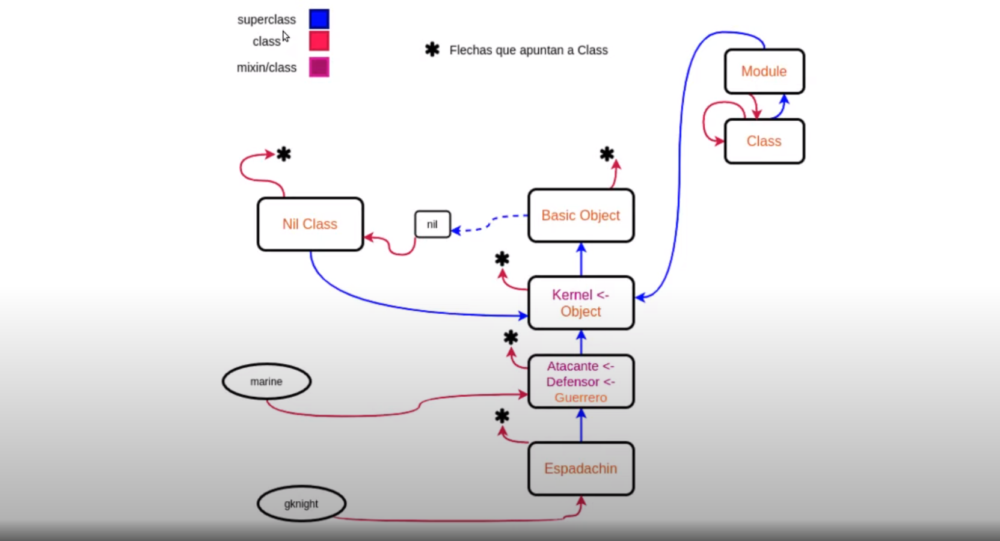
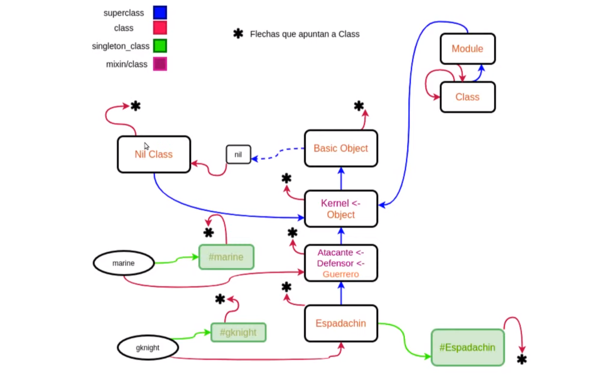
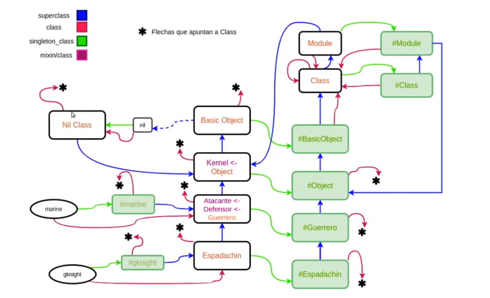

# Metaprogramación en Ruby

Es el proceso o la práctica por la cual escribimos programas que generan, manipulan o utilizan otros programas.

Por ejemplo:

- Compiladores
- Formateador de Código
- Herramientas de generación de Documentación

Se usa para:

- Desarrollo de Frameworks y herramientas
- Dominio de los frameworks


Por ejemplo:

- ORMs
- Testing
- Documentador de Código (Ej JavaDoc)
- Analizadores de código
- Code Coverage


## Reflection

Es el caso en el que *metaprogramamos* en el mismo lenguaje que los programas.

Tipos de Reflection:

- Instrospección
  - Herramientas que nos permiten analizar el código.
  - El programa puede verse a si mismo.
- Self-Modification
  - El programa puede modificarse a sí mismo. Cambiar su comportamiento.
  - La JVM no soporta Self-Modification
- Intercession
  - La capacidad de un lenguaje de modificar/agregar características no soportadas nativamente.
  - Por ejemplo añadir soporte de Objetos a Lisp.

Usamos PRY para tener un intérprete de Ruby.

## Instrospección

```ruby
> require_relative 'age.rb'
=> True

> marine = Guerrero.new
=> #<Guerrero:0x007f9d8b9d8d28 @energia=100, @potencial_defensivo=10, @potencial_ofensivo=20>

# Podemos saber la clase de marine

> marine.class
=> Guerrero

# También podemos saber las superclases

> marine.class.superclass
=> Object

# Podemos saber qué mensajes le podemos enviar:

> marine.methods
=> [:energia, :potencial_defensivo, :potencial_ofensivo, :descansado=, :peloton=, :descansar, :sufri_danio, .......]

> marine.class.instance_methods false ## False para no incluir los métodos de las superclases
=> [:descansar_atacante, :descansar_defensor, :peloton, :lastimado, :cansado, :sufri_danio, :descansar, :peloton=]

# Formas de enviarle un mensaje:

> marine.descansar
=> 110

> marine.send(:descansar) # Es un símbolo
=> 120

> sym = :descansar
> marine.send(sym)
=> 130

## Métodos... ¿Privados?

class A
  def bleh
    2
  end

  private # De acá para abajo es TODO privado a menos que especifique PUBLIC
  def metodo_privado
    'Estamos en un método privado'
  end
end

> a = A.new
=> #<A:0x007f9d8b9d8d28>

> a.bleh
=> 2

> a.metodo_privado
=> NoMethodError: private method `metodo_privado` called for #<A:0x007f9d8b9d8d28>

> a.send(:metodo_privado)
=> "Estamos en un método privado"

# Si quiero una instancia de un método:

> metodo_descansar_marine = marine.method(:descansar)
=> #<Method: #<Guerrero:0x007f9d8b9d8d28 @energia=100, @potencial_defensivo=10, @potencial_ofensivo=20, @descansado=true>.descansar>

## Tenemos un método bindeado a la instancia y puedo llamarlo

> metodo_descansar_marine.call
=> 150

> metodo_recibir_danio = marine.method(:sufri_danio)
=> ...

> metodo_recibir_danio.parameters
=> [[:req, :danio]] ## Es una tupla, que en ruby se representa así. En este caso el danio es obligatorio

> metodo_recibir_danio.arity
=> 1

> metodo_recibir_danio.receiver
=> #<Guerrero:0x007f9d8b9d8d28 @energia=100, @potencial_defensivo=10, @potencial_ofensivo=20, @descansado=true>

> metodo_recibir_danio.receiver == marine
=> true

# Para desasociarlo:

> metodo_descansar = marine.class.instance_method :descansar ## Nota: Es method, sin S
=> #<UnboundMethod: Guerrero#descansar> # No va a entender ni call ni receiver!

> metodo_descansar.bind(marine)
=> #<Method: Guerrero#descansar>

> metodo_descansar.receiver == marine
=> true

> metodo_descansar.bind(a)
=> TypeError: bind argument must be an instance of guerrero # Esto se checkea a nivel compilador, no lo podemos arreglar

> metodo_descansar.owner
=> Guerrero

> unbound_method = marine.class.instance_method :atacar
=> #<UnboundMethod: Guerrero#atacar>

> unbound_method.owner
=> Atacante # Es el que define el método

## Jerarquía de clases

> Espadachin.superclass
=> Guerrero

> Espadachin.superclass.superclass
=> Object # Y los mixines? 

> Espadachin.ancestors
=> [Espadachin, Guerrero, Defensor, Atacante, Object, Kernel, BasicObject]


## Variables de Instancia

> marine.instance_variables
=> [:@energia, :@potencial_defensivo, :@potencial_ofensivo, :@descansado]

> marine.instance_variable_get(:@energia)
=> 150

> marine.instance_variable_set(:@energia, 20)
=> 20
```


## Self-Modification

*Como una operación a corazón abierto*

Las clases son abiertas y pueden ser redefinidas, aún ya habiendo cargado el `.rb`


```ruby
> Guerrero
=> Guerrero # Ya definido

> class Guerrero
    def blah
      2
    end
  end

=> :blah # Agregué un método a una clase que ya existe

> s = Guerrero.new
=> #<Guerrero:0x007f9d8b9d8d28 @energia=100, @potencial_defensivo=10, @potencial_ofensivo=20>

> s.energia
=> 100

> s.blah
=> 2

> marine.blah # También para instancias que ya teníamos de antes!
=> 2

# Podemos pisar los métodos

> class Guerrero
    def energia
      34
    end
  end

=> :energia

> class Guerrero
    def energia
      42
    end
  end

=> :energia

> marine.energia
=> 42 

> class Guerrero
    def energia=
      41
    end
  end
=> :energia=

> marine.energia= 30
=> ArgumentError: wrong number of arguments (given 1, expected 0) 
# La firma del método es únicamente el nombre. El resto se evalúa al uso

# Pueden hacerse cosas mucho más peligrosas
> class Object
    def sarasa
      42
    end
  end

=> :sarasa

> 2.sarasa
=> 42

> marine.sarasa
=> 42

> class Integer
    def +(a)
      2
    end
  end
=> :+

> 2 + 2
=> 2
```

- Open Clases: Las clases son abiertas.
- Duck Typing: Nos referimos a un tipo de dato no por el *Tipo* en sí, sino por su comportamiento
  > ... if it walks like a duck and talks like a duck, it's a duck, right?
- Monkey Patching: La posibilidad de modificar una clase a gusto para que responda a las necesidades que tenemos.
  > If it walks like a monkey and talks like a monkey, it's a monkey, right?. So if this monkey is not giving you the noise that you want, you've got to just punch that monkey until it returns what you expect.


## Metamodelo en Ruby

> Así como todo programa construye un modelo para describir su dominio, los lenguajes pueden hacer lo mismo para describir sus abstracciones. El dominio de un metaprograma son los programas. El programa describe las características de los elementos del dominio utilizando clases, métodos, atributos entre otros. Entonces, el modelo puede contener por ejemplo una clase Guerrero, que modela a los guerreros en el domino. Un metaprograma usará el metamodelo que describe al programa base. Así como en el dominio hay guerreros, los elementos del “metadominio” serán las construcciones del lenguaje. Por ejemplo: clases, atributos, métodos.


```ruby

> marine.class
=> Guerrero

> Guerrero.class # Tiene sentido preguntar la clase de una clase?...
=> Class

> Object.class
=> Class

> Object.class.is_a? Class
=> true

> Object.class.class
=> Class

> Espadachin.superclass.superclass.superclass
=> BasicObject # Parecería ser el punto más alto en la Jerarquía de clases

> Espadachin.superclass.superclass.superclass.superclass
=> nil 

> BasicObject.superclass.is_a? Class
=> false

> BasicObject.superclass.superclass
=> NoMethodError: undefined method `superclass` for nil:NilClass

> nil.class
=> NilClass # Singleton

> nil.class.class
=> Class

> nil.class.superclass
=> Object

> Class.superclass
=> Module

> Class.superclass.superclass
=> Object

## Qué pasa con los modules?

> Atacante.class
=> Module

> Atacante.class.class
=> Class

> Atacante.class.superclass
=> Object

```

<div align="center">
  
</div>


## EigenClass

Su única funcionalidad es proveer comportamiento a una clase, para esa clase en particular.

```ruby

class Escuadron
  attr_accessor :integrantes

  def self.entrenar(integrantes)
    check_atacantes integrantes
    self.new(integrantes)
  end

  def self.entrenar_guerreros(integrantes)
    check_guerreros integrantes
    self.new(integrantes)
  end

  def initialize(integrantes)
    self.integrantes = integrantes
  end

  protected
  def self.check_guerreros(integrantes)
    raise StandarError.new('Uno de los integrantes no es guerrero') if integrantes.any? { |i| !i.is_a? Guerrero }
  end

  def ser.check_atacante(integrantes)
    raise StandarError.new('Uno de los integrantes no es atacante') if integrantes.any? { |i| !i.is_a? Atacante }
  end

end


> Escuadron.methods.include? :entrenar
=> true

> Escuadron.class.instance_methods.include? :entrenar
=> false

> Escuadron.methods.include? :new
=> true

> Escuadron.class.instance_methods.include? :new
=> true

> Escuadron.class
=> Class

# EigenClass

> Escuadron.singleton_class
=> #<Class:Escuadron>

# Podemos definir comportamiento sólo para Escuadron

> Escuadron.singleton_class.instance_methods false
=> [:entrenar, :entrenar_guerreros, :check_guerreros, :check_atacante]

# Todo objeto tiene asociado UNA singleton class. Dos objetos, aunque sean de la misma clase tienen distintos singleton_class

> marine2 = Guerrero.new
=> #<Guerrero:0x007f9d8b9d8d28 @energia=100, @potencial_defensivo=10, @potencial_ofensivo=20>

> module Saludar
    def saludar
      "hola"
    end
  end
=> :saludar

> marine2.singleton_class.include Saludar
=> #<Class:Guerrero:0x007f9d8b9d8d28>

> marine2.saludar
=> "hola"

> marine.saludar
=> NoMethodError: undefined method "saludar" for #<Guerrero:0x007f9d8b9d8d28 @energia=100, @potencial_defensivo=10, @potencial_ofensivo=20>

> marine.singleton_class.superclass
=> Guerrero

```

<div align="center">
  
</div>


## Method Lookup

```ruby
> Guerrero.singleton_class
=> #<Class:Guerrero>

> Guerrero.singleton_class.instance_methods false
=> []

> Guerrero.singleton_class.instance_methods.include? :new
=> true ## Hay una Jerarquía de Singleton Classes!!


> Espadachin.singleton_class
=> #<Class:Espadachin>

> Espadachin.singleton_class.superclass
=> #<Class:Guerrero> # La singleton class de guerrero

> Espadachin.singleton_class.superclass.superclass
=> #<Class:Object> # La singleton class de Object

> Espadachin.singleton_class.superclass.superclass.superclass
=> #<Class:BasicObject> # La singleton class de BasicObject

> BasicObject.singleton_class.superclass
=> Class
```

<div align="center">
  
</div>

Finalmente la Jerarquía queda:

```rb
> Guerrero.new
> marine.energia
```

- Una flecha verde
- N Flechas azules hasta Class

Si no encuentra:

- Module
- Object
- BasicObject
- nil
  - Explota


